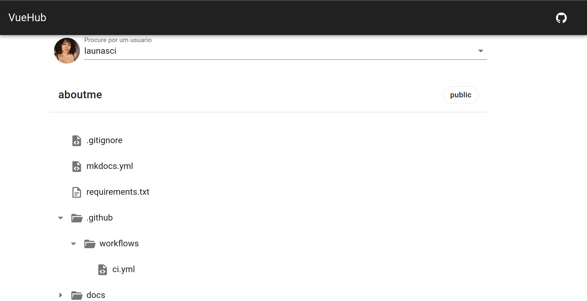

<p align="center"> 
<h1> vueHub - projeto em construção </h1>

<h2> A ideia desse projeto,desenvolvido no programa buserTech, foi construir um navegador de repositórios do GitHub com o objetivo de melhorar o conhecimento em Vue.js e Vuetify. </h2>

----


> <h3> O que foi construindo até o momento: </h3>
> <ul>
>    <li> Localizar os repositórios de um usuario por meio do user do gitHub</li>
>    <li>Escolher um repositório espécifico e navegar pelos diretorios.</li>
>  </ul>

----

> <h3> O que ainda vai ser feito: </h3>
> <ul>
>    <li>Apromimorar a navegação em arvore. Para uma primeira é surpreendente, mas tem como refinar!</li>
>    <li>Adicionar a possibilidade de visualização do conteúdo de um arquivo. Isso facilita muito e torna mais funcional o    projeto</li>
>  </ul>

- - - - 
<h1>
   <a href="https://vuehub.netlify.app/" target="_blank">
      Acesse o VueHub
   </a>
   <a href="https://vuehub.netlify.app/" target="_blank">
      
   </a>
</h1>
 
<h2>Caso você queira rodar esse projeto na sua maquina é importante fazer o setup antes. Aqui tem um passo a passo:
</h2>

## setup inicial:
```
npm install
```

### sobe um servidor para brincar com o projeto na sua maquina
```
npm run serve
```

### builda o projeto pra prod 
```
npm run build
```

### arrumar erros do lint :)
```
npm run lint
```

### Mais informações: [Configuration Reference](https://cli.vuejs.org/config/).
</p>